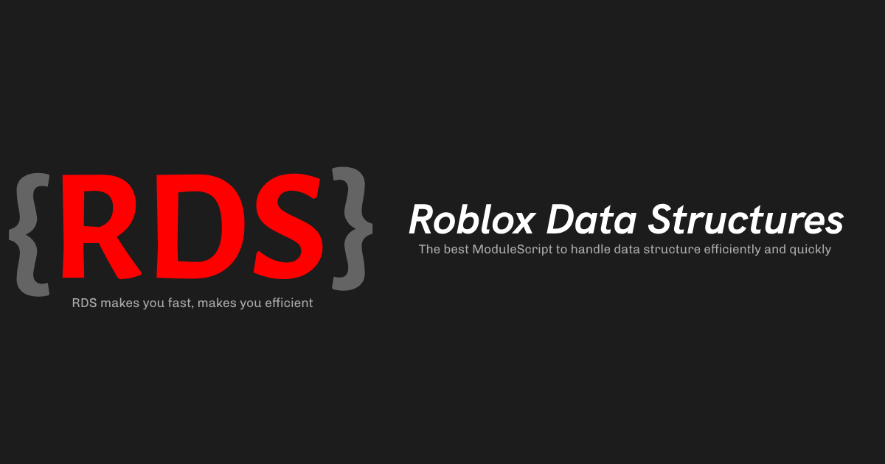

# Introduction

RDS is a ModuleScript that adds new data structures to LUAU with powerful and efficient methods to drive your game to success

This ModuleScript was made for the Roblox Studio community, not to benefit from this, we only help the community to support it and make it grow, we are not professionals in this but we want to put our grain of sand since roblox does not help us with this kind of things

## Code Examples

> Filter only even numbers
```lua
local Array = require("<module-location>")
local numbers = Array.new(1, 2, 3, 4, 5, 6, 7, 8, 9, 10)

local evenNumbers = numbers:filter(function(el)
    return el % 2 == 0
end)

print(evenNumbers) -- [2, 4, 6, 8, 10]
```

> Obtain the square of all numbers
```lua
local Array = require("<module-location>")
local numbers = Array.new(1, 2, 3, 4, 5, 6, 7, 8, 9, 10)

local squareNumbers = numbers:map(function(el)
    return el ^ 2
end)

print(squareNumbers) -- [1, 4, 9, 16, 25, 36, 49, 64, 81, 100]
```

> Check if all the elements of an array meet a condition
```lua
local Array = require("<module-location>")
local numbers = Array.new(1, 2, 4, 5, 6, 2, 8, 4, 3, 2)

print(numbers:every(function(el)
    return el > 3
end)) -- false (not all elements are greater than 3)
```

---

<h2 align="center"> Made by and for the community, for you, for everyone. </h2>
<p align="center">Scripted by iiAngel and ecstatic5</p>